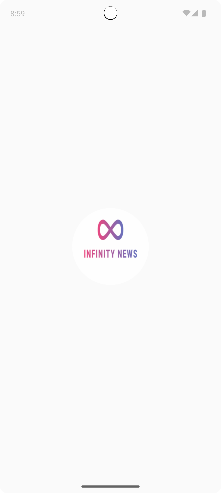

# Infiniti News
News app made in Jetpack Compose with clean architecture using using MVI. This application mostly emphasizes on layered architecture. Not much is done in designs and animations.

## Screens and Sections
- HeadLines
- All News
- News Detail


## Screenshots
|                     Splash                     |                     Main                     |                    Detail                     |
|:----------------------------------------------:|:--------------------------------------------:|:---------------------------------------------:|
|    |  |   |


## Installation
### 1. Clone the repo
```bash
git clone https://github.com/Hassaan10/Infiniti-News-Android.git
cd Infiniti-News-Android
```

### 3. Add your API key into RequestInterceptor file
X-Api-Key = 'YOUR_API_KEY';


## Libraries
- For networking I am using retrofit
- For network image I am using coil
- For navigation I am using compose-navigation
- For dependency injection I am using Hilt

## API Key
Get your API key at https://newsapi.org/


