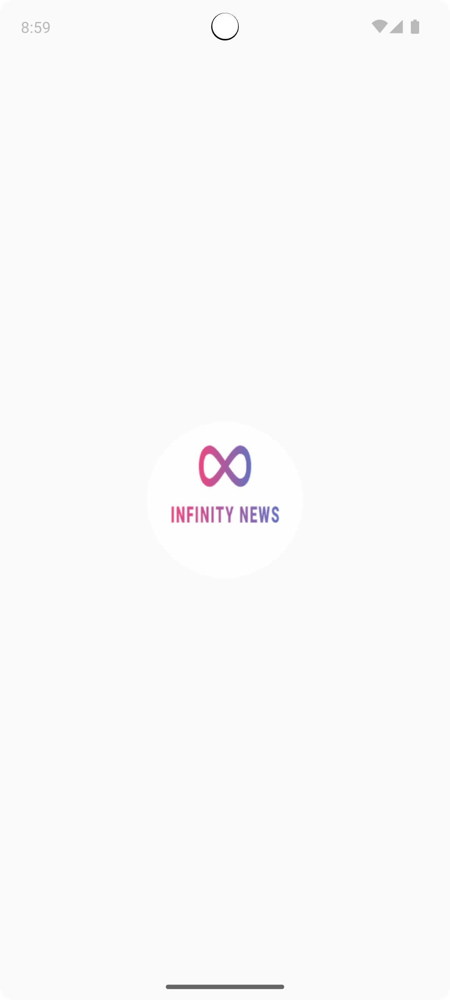

# Infiniti News App (Android)

A simple and efficient News App for Android built with Kotlin, Jetpack Compose, Hilt, Retrofit, and Clean Architecture. The app fetches the latest news articles from a public API and displays them in a user-friendly interface.

## Features

- Browse the latest news articles by category.
- View news article details with rich content.
- Clean, modern, and responsive UI built using Jetpack Compose.
- Dependency injection using Hilt for better scalability and testability.
- Fetch data from an external API with Retrofit.
- Organized using Clean Architecture principles.

## Technologies Used

- **Kotlin** – The primary programming language for Android development.
- **Jetpack Compose** – Modern UI toolkit for building native UIs in a declarative way.
- **Hilt** – Dependency injection library for Android.
- **Retrofit** – HTTP client to fetch data from the news API.
- **Clean Architecture** – A software design pattern to organize and separate concerns in the app.
- **Coroutines** – Asynchronous programming for smooth UI and background operations.
- **ViewModel & LiveData** – Managing UI-related data lifecycle-consciously.

## Architecture Overview

This app follows **Clean Architecture**, which divides the app into layers:

- **Data Layer** – Handles data fetching, parsing, and storage. Uses Retrofit for API calls.
- **Domain Layer** – Contains business logic, entities, and use cases.
- **Presentation Layer** – Responsible for UI using Jetpack Compose and managing state with ViewModel.

## Setup

1. Clone the repository:

   ```bash
   git clone https://github.com/your-username/news-app.git

2. Open the project in Android Studio.
3. Sync the project with Gradle files.
4. Add your API key into RequestInterceptor file (X-Api-Key = 'YOUR_API_KEY')
5. Build and run the app on an emulator or a physical device.

## Screenshots

|                     Splash                     |                     Main                     |                    Detail                     |
|:----------------------------------------------:|:--------------------------------------------:|:---------------------------------------------:|
|    |  |   |


## GIF


## API Documentation
This app fetches news data from the News API. You may need to create a free account and generate an API key to make the app work with your own API key.

## How to Contribute
1. Fork this repository.
2. Create a new branch (git checkout -b feature/your-feature).
3. Commit your changes (git commit -am 'Add new feature').
4. Push to the branch (git push origin feature/your-feature).
5. Create a new Pull Request.

## Acknowledgements
- News API for providing the news articles.
- Jetpack Compose for building modern UIs.
- Retrofit for network requests.
- Hilt for dependency injection.

## API Key
Get your API key at https://newsapi.org/


